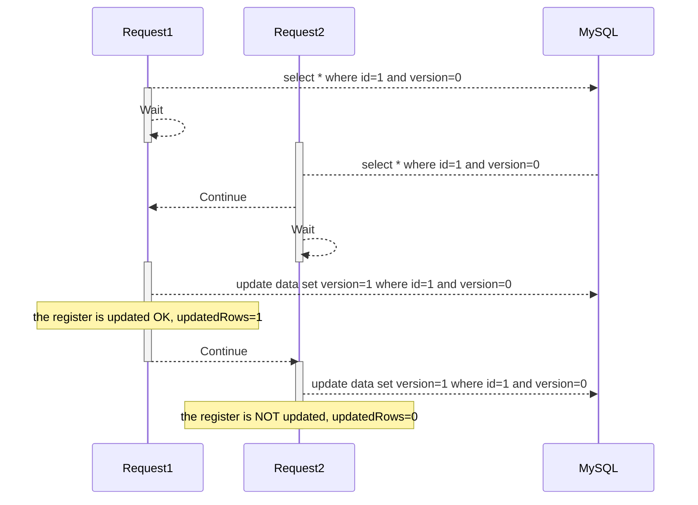

# mysql-concurrency

Project to test several concurrency scenarios with MySQL and NodeJS
Projecte fet amb NodeJS, express, MySQL i semàfors per testejar diferents escenaris de concurrència

## scenarios

### Escenari 1: control sense bloqueigs de BD

Concurrencia de peticions per modificar 1 registre:

1. Es llença una petició de modificar un registre de la BD
2. El procés recupera el registre i s'espera a que s'inicii una petició del mateix registre
3. Es llença una altra petició per modificar el mateix registre de la BD
4. El procés recupera el registre, desbloqueja lel primer procés i s'espera a que el primer procés acabi
5. El primer procés actualitza el registre, desbloqueja el segon procés i finalitza
6. El segon procés intenta actualitza i no pot ja que s'ha modificat per un altre procés i finalitza

### Escenari 2: control amb bloqueig de taula a nivell d BD

## Changelog

V 1.0.0:
